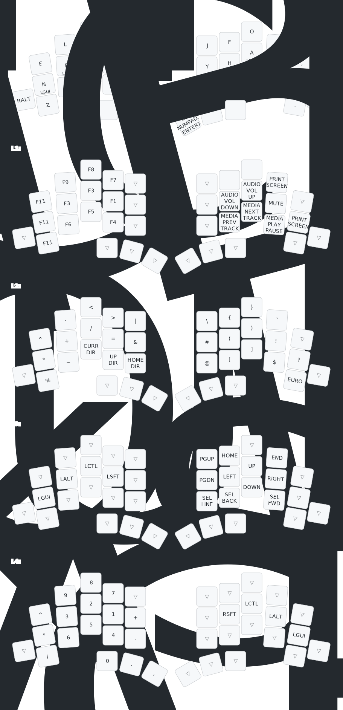

# TOTEM QMK keymap

This is a personal [QMK](https://qmk.fm) configuration for the [TOTEM](https://github.com/GEIGEIGEIST/TOTEM) split keyboard.
The layout is a Vim friendly version of [Gallium](https://github.com/GalileoBlues/Gallium), with additional layers inspired by [Pascal Getreuer's keymap](https://github.com/getreuer/qmk-keymap).

## Setup

```
uv tool install qmk
qmk setup
```

After that, clone this repository to the correct location.
Assuming default paths this is can be done with:

```
git clone https://github.com/SamuelBorn/qmk-keymap.git ~/qmk_firmware/keyboards/totem
```

Then *connect* the left half and *press reset button twice*.
Then run:

```
qmk flash -kb totem -km default -bl uf2-split-left
```

Then connect, reset, flash the second half:

```
qmk flash -kb totem -km default -bl uf2-split-right
```

## Visualization

The visualization below is generated with [keymap-drawer](https://github.com/caksoylar/keymap-drawer). 
To update it, run the following commands:
```
qmk c2json keymaps/default/keymap.c | keymap -c visualize/keymap-drawer-config.yaml parse -c 12 -q - > visualize/keymap.yaml
keymap -c visualize/keymap-drawer-config.yaml draw visualize/keymap.yaml > visualize/keymap.svg
```


