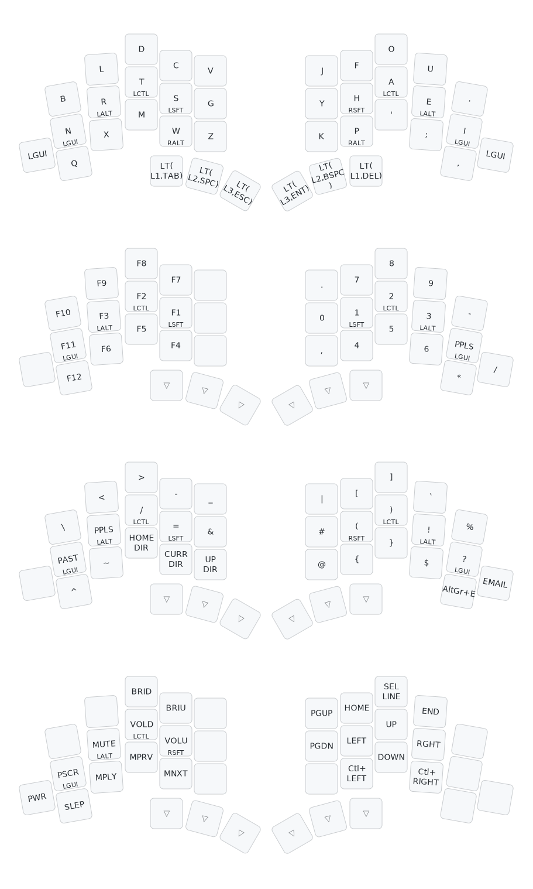

# TOTEM QMK Keymap

This is a personal [QMK](https://qmk.fm) configuration for the [TOTEM](https://github.com/GEIGEIGEIST/TOTEM) split keyboard, using the [Gallium](https://github.com/GalileoBlues/Gallium) layout.

## Setup

First, ensure QMK is set up on your system. 

Next, clone this repository into your QMK keyboards directory. Assuming default paths, use the following command:

```bash
git clone https://github.com/SamuelBorn/qmk-keymap.git ~/qmk_firmware/keyboards/totem
```

To flash the firmware, connect one half of the keyboard at a time, press its reset button twice, and run the corresponding command.

```bash
# For the left half:
qmk flash -kb totem -km default -bl uf2-split-left

# For the right half:
qmk flash -kb totem -km default -bl uf2-split-right
```

## Visualization

The graphic below is generated with [keymap-drawer](https://github.com/caksoylar/keymap-drawer).
Not documented in this graphic are combos and [Caps Word](https://docs.qmk.fm/features/caps_word).


